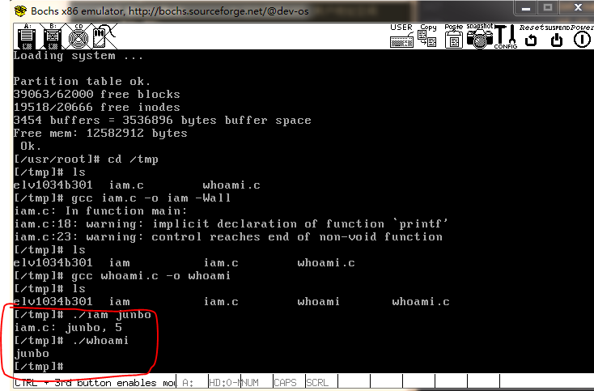

# 系统调用
## 实验目的
+ 建立对系统调用接口的深入认识
+ 掌握系统调用的基本过程
+ 能完成系统调用的全面控制
+ 为后续实验做准备

## 实验说明
+ 本实验需要读者在了解Linux中断处理机制和系统调用过程的基础上完成。可以参考本人的[读书笔记](./chapter05_note.md)

## 实验内容
此次试验基本内容：在Linux0.11上添加两个系统调用，并编写两个简单的应用程序测试它们。

**iam()**
第一个系统调用是iam(),原型：   

    int iam(const char* name);

  完成的功能是将字符串参数name的内容拷贝到内核中保存下来。要求name的长度不能超过23个字符。返回值是拷贝的字符数。如果name的字符个数超过了23，则返回“-1”，并置errno为EINVAL。

  在kernal/who.c中实现此系统调用。

  **whoami()**   
第二个系统调用是whoami()，其原型为：

    int whoami(char* name, unsigned int size);

它将内核中由iam()保存的名字拷贝到name指向的用户地址空间中，同时确保不会对name越界访存（name的大小由size说明）。返回值是拷贝的字符数。如果size小于需要的空间，则返回“-1”，并置errno为EINVAL。

也是在kernal/who.c中实现。

**测试程序**

运行添加过新系统调用的Linux 0.11，在其环境下编写两个测试程序iam.c和whoami.c。最终的运行结果是：
```bash
\$ ./iam junbo

\$ ./whoami

junbo
```

## 实验步骤
1. 将Linux0.11的源代码恢复到原始状态，在phyoslab目录下执行：
```bash
./run init
```
2. **本实例中调用系统调用过程** (没有通过系统库函数调用)
 + 把系统调用编号存入eax；
 + 把函数参数存入ebx、ecx、edx；
 + 触发0x80号中断（int 0x80）。

3. 先看看_syscall3 宏的实现代码：    

          #define _syscall3(type,name,atype,a,btype,b,ctype,c) \
          type name(atype a,btype b,ctype c) \
          { \
          long __res; \
          __asm__ volatile ("int $0x80" \
              : "=a" (__res) \
              : "0" (__NR_##name),"b" ((long)(a)),"c" ((long)(b)),"d" ((long)(c))); \
          if (__res>=0) \
              return (type) __res; \
          errno=-__res; \
          return -1; \
          }

4. **在kernel/who.c中实现sys_iam()和sys_whoami()**    

        int sys_iam(const char *name)
        {
            unsigned int namelen = 0;
            int i = 0;
            int res = -1;
            //printk("Now we in kernel's sys_iam\n");
            while (get_fs_byte(name+namelen) != '\0')
                    namelen++;
            if (namelen <= NAMELEN) {
                    //printk("All %d user space's chars to be copied to the kernel\n", namelen);
                    //printk("Copying from user to kernel...\n");
                    for(i = 0; i < namelen; i++) {
                            username[i] = get_fs_byte(name+i);
                    }
                    //printk("Done!\n");
                    username[i] = '\0';
                    //printk("%s\n", username);
                    res = namelen;
            } else {
                    printk("Error, the user space's name's length is %d longer than 23!\n", namelen);
                    res = -(EINVAL);
            }
            return res;
        }

        int sys_whoami(char *name, unsigned int size)
        {
            unsigned int namelen = 0;
            int i = 0;
            int res = -1;
            //printk("Now we in kernel's sys_whoami\n");
            while(username[namelen] != '\0')
                    namelen++;
            if (namelen < size) {
                    //printk("All %d kernel's chars to be copied to user space\n", namelen);
                    //printk("Copying from kernel to user...\n");
                    for (i = 0; i < namelen; i++) {
                            put_fs_byte(username[i], name+i);
                    }
                    //printk("Done!\n");
                    put_fs_byte('\0', name+i);
                    res = namelen;
            } else {
                    printk("Error, the kernel's name's length is longer than %d\n", size);
                    res = -(EINVAL);
            }
            return res;
        }

5. 注册系统调用
  + 在include/unistd.h中定义系统调用编号    

                #define __NR_iam        72
                #define __NR_whoami     73

  + 在kernel/system_call.s中：    

                nr_system_calls = 74 #设置系统调用的总数，原来是72个

  + 在include/linux/sys.h中将系统调用编号和处理函数关联    
  在sys_call_table中添加sys_whoami和sys_iam两项，并在上面声明：    
  
                extern int sys_whoami();
                extern int sys_iam();

6. 修改kernel/Makefile    
一处是OBJS后面添加who.o：
                OBJS  = sched.o system_call.o traps.o asm.o fork.o \
                panic.o printk.o vsprintf.o sys.o exit.o \
                signal.o mktime.o who.o
另一处添加依赖：    

          \### Dependencies:
          who.s who.o: who.c ../include/linux/kernel.h ../include/unistd.h
          exit.s exit.o: exit.c ../include/errno.h ../include/signal.h \
            ../include/sys/types.h ../include/sys/wait.h ../include/linux/sched.h \
            ../include/linux/head.h ../include/linux/fs.h ../include/linux/mm.h \
            ../include/linux/kernel.h ../include/linux/tty.h ../include/termios.h \
            ../include/asm/segment.h

7. 编译    
若在编译时出现错误，可以调用printk()函数进行调试

8. 编写应用层测试程序    

        //iam.c
        _syscall1(int, iam, const char*, name)

        #define NAMELEN 100
        char name[NAMELEN];

        int main(int argc, char *argv[])
        {
                int res;
                int namelen = 0;
                if (2 <= argc) {
                        while ((name[namelen] = argv[1][namelen]) != '\0')
                                namelen++;
                        printf("iam.c: %s, %d\n", name, namelen);
                        res = iam(name);
                                errno = EINVAL;
                        return res;
                }
        }
        --------------------------------------------------------
        //whoami.c
        _syscall2(int, whoami, char*, name, unsigned int, size)

        #define SIZE 23

        int main(void)
        {
                char name[SIZE+1];
                int res;
                res = whoami(name, SIZE+1);
                if (res == -1)
                        errno = EINVAL;
                else
                        printf("%s\n", name);
                return res;
        }

9. 运行linux0.11并编译运行测试程序    
在这之前需要将iam.c和whoami.c拷贝到0.11中（使用实验一的宿主机与0.11文件交换的方法）    
另外运行0.11之后的unistd.h文件是gcc标准库文件而不是linux0.11源码中的unistd.h文件，需要在/usr/unistd.h中添加：
        #define __NR_iam        72
        #define __NR_whoami     73
        同样可以使用挂载方法修改0.11文件系统中的内容
然后
        gcc iam.c -o iam -Wall
        gcc whoami.c -o whoami -Wall

10. 运行结果:    

