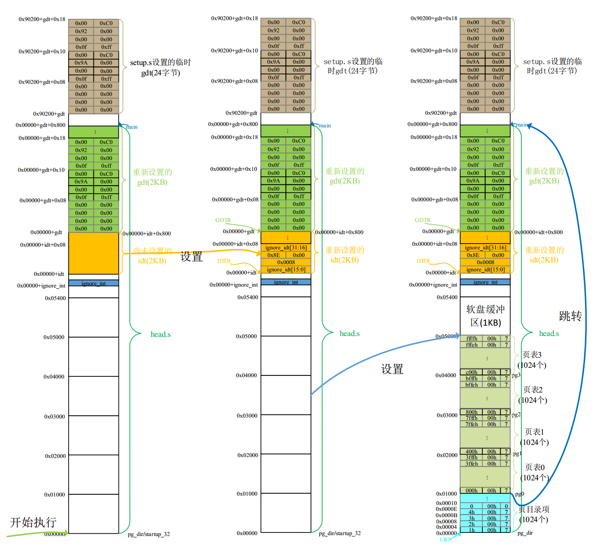

# head.s 程序    
## 一、功能描述    
&emsp;&emsp;head.s程序在被编译生成目标文件后会与内核其他程序一起被链接成system模块，位于system模块的最前面开始部分，这也就是为什么称其为头部(head)程序的原因。system模块将被放置在磁盘上setup模块之后开始的扇区中，即从磁盘上第6个扇区开始放置。一般情况下Linux 0.11内核的system模块大约有120KB左右，因此在磁盘上大约占240个扇区。    

&emsp;&emsp;从这里开始，内核完全是在保护模式下运行了。head.s汇编程序与前面的语法格式不同，它采用的是AT&T的汇编语言格式，并且需要使用GNU的gas和gld进行编译链接。    

## 二、head.s 执行过程

&emsp;&emsp;&emsp;&emsp;&emsp;&emsp;head.s执行中的内存使用情况图：     

&emsp;&emsp;这段程序实际上处于内存绝对地址0处开始的地方。这个程序的功能比较单一。首先是加载各个数据段寄存器，重新设置中断描述符表idt，共256项，并使各个表项均指向一个只报错误的哑中断子程序ignore_int。中断描述符表中每个描述符项也占8字节。    

&emsp;&emsp;在设置完中断描述符表之后，本程序又重新设置了全局段描述符表gdt。实际上新设置的GDT表与原来在setup.s程序中设置的GDT表描述符除了在段限长上有些区别以外(原为8MB，现为16MB)，其他内容完全一样。因此这里重新设置GDT的主要原因是为了把gdt表放在内存内核代码比较合理的地方。    

&emsp;&emsp;接着使用物理地址0与1MB开始处的字节内容相比较的方法（涉及wrap-around技术），检测A20地址线是否已真的开启。    

&emsp;&emsp;接着设置管理内存的分页处理机制，将页目录表放在绝对物理地址0开始处（将覆盖head.s程序的一部分)，紧随后面放置共可寻址16MB内存的4个页表（每个页表可寻址1024*4K=4M），并分别设置它们的表项。    

&emsp;&emsp;每个表项的属性标志都被设置成0x07（P=1、U/S=1/、R/W=1），表示该页存在，用户可读写。这样设置内核页表属性的原因是：CPU的分段机制和分页管理都有保护方法。分页机制中页目录表和页表项中设置的保护标志需要与段描述符中的特权级（PL）保护机制一起组合使用。但段描述符中的PL起主要作用。CPU会首先检查段保护，然后检查页保护。如果当前特权级CPL<3，则说明CPU正在以超级用户身份运行。此时所有页面都能访问，并可随意进行内存读写操作。如果CPL=3，则说明CPU正在以（User）身份运行。此时只有属于User的页面（U/S=1)可以访问，并且只有标记为可读写页面(W/R=1)是可写的。此时对属于Supervisor的页面(U/S=0)则既不可写、也不可读。由于内核代码有些特别之处，即其中包含有任务0和任务1的代码和数据。因此这里把页面属性设置为0x7就可以保证这两个任务代码不仅可以在用户态下执行，而且又不能随意访问内核资源。    

&emsp;&emsp;最后，head.s程序利用返回指令将预先放置在堆栈中的init/main.c程序的入口地址弹出，去执行main()程序。
