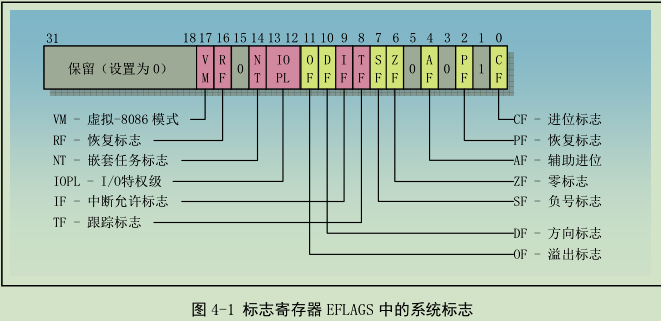
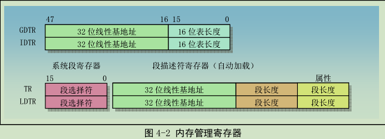

# 第四章 80x86保护模式第一部分——系统寄存器和系统指令  
### 概述  
为了协助处理器执行初始化和控制系统操作，80X86提供了一个标志寄存器EFLAGS和几个系统寄存器，EFLAGS中包含一些通用状态标志，另外还有几个系统标志。这些系统标志用于控制任务切换、中断处理、指令跟踪以及访问权限。系统寄存器用于内存管理和控制处理器操作，还有分段和分页处理机制系统表的基地址、控制处理器操作的比特标志位。

### 1、标志寄存器
    
如上图，标志寄存器EFLAGS中的系统标志（左边部分）和IOPL字段用于控制I/O访问、可屏蔽硬件中断、调试、任务切换以及虚拟-8086模式。通常只允许操作系统代码有权修改这些标志。    
+ TF：位8是跟踪标志（Trap Flag）。当设置该位时可为调试操作启动单步执行方式；复位时则进制单步执行。在单步执行方式下，处理器会在每个指令执行之后产生一个调试异常，这样我们就可以观察执行程序在执行每条指令后的状态。如果程序使用POPF、POPFD或IRET指令设置了TF标志，那么在随后指令之后处理器就会产生一个调试异常。

+ IOPL：位12-13是I/O特权级字段。该字段指明当前运行程序或任务的I/O特权级IOPL。当前运行程序或任务的CPL必须小于等于这个IOPL才能访问I/O地址空间。只有当CPL为特权级0时，程序才可以使用POPF或IRET指令修改这个字段。IOPL也是控制对IF标志修改的机制之一。

+ NT：位14是嵌套任务标志（Nested Task）。它控制着被中断任务和调用任务之间的链接关系。在使用CALL指令、中断或异常执行任务调用时，处理器会设置该标志。在通过使用IRET指令从一个任务返回时，处理器会检查并修改这个NT标志。使用POPF/POPFD指令也可以修改这个标志，但是在应用程序中改变这个标志的状态会产生不可意料的异常。

+ RF：位16是恢复标志（Resume Flag）。该标志用于控制处理器对断点指令的响应。

+ VM：位17是虚拟-8086方式（Virtual-8086 Mode)标志。当设置该标志时，就开启虚拟-8086方式；当复位该标志时，则回到保护模式。

### 2、内存管理寄存器
+ 处理器提供了4个内存管理寄存器（GDTR、LDTR、IDTR和TR），用于指定分段内存管理所使用的系统表的基地址。如下图：    

+ GDTR、LDTR、IDTR和TR都是段基址寄存器，这些段中含有分段机制的重要信息表。GDTR、IDTR和LDTR用于寻址存放描述符表的段。TR用于寻址一个特殊的任务状态段TSS。TSS段中包含着当前执行任务的重要信息。
  + 全局描述符表寄存器GDTR    
    GDTR寄存器中存放GDT的32位线性基地址和16位表长度值。

  + 中断描述符表寄存器IDTR    
    和GDTR类似。

  + 局部描述符表寄存器LDTR    
    LDTR寄存器中用于存放局部描述符表LDT的32位线性基地址、16位段限长和描述符属性值。包含LDT表的段必须在GDT表中有个段描述符项。

  + 任务寄存器TR    
    TR寄存器用于存放当前任务TSS段的16位段选择符、32位基地址、16位段长度和描述符属性值。它引用GDT表中的一个TSS类型的描述符。

### 3、控制寄存器    
**#TODO：**
