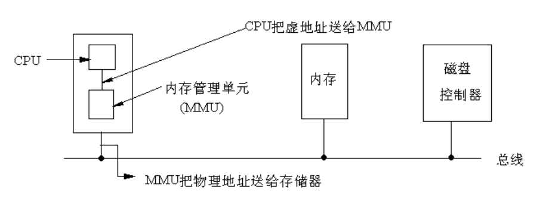
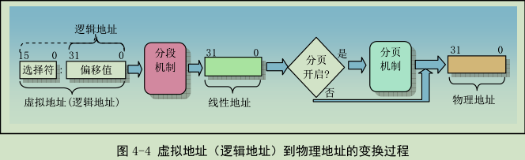
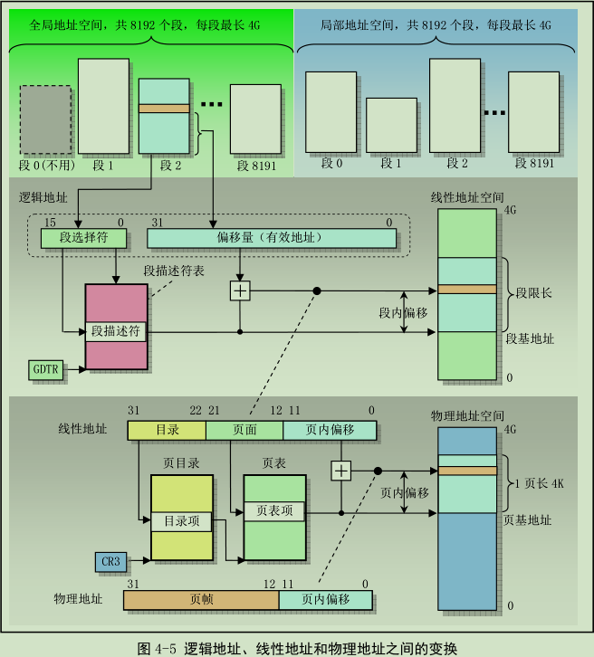
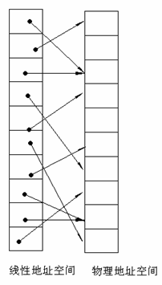
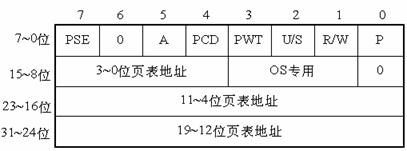
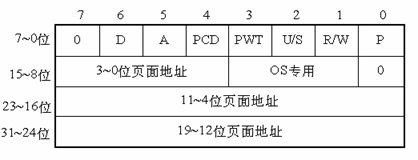
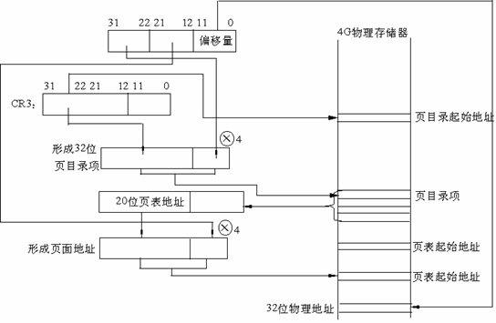

# 保护模式第二部分—保护模式内存管理    

## 一、保护模式的起源
&emsp;&emsp;最开始的程序寻址是直接的“段：偏移”模式，这样的好处是所见即所得，程序员指定的地址就是物理地址，物理地址对程序员是可见的。但是，由此也带来两个问题：**1）无法支持多任务2）程序的安全性无法得到保证(用户程序可以改写系统空间或者其他用户的程序内容)**。    

&emsp;&emsp;实模式将整个物理内存看成分段的区域,程序代码和数据位于不同区域，系统程序和用户程序没有区别对待，而且每一个指针都是指向"实在"的物理地址。这样一来，用户程序的一个指针如果指向了系统程序区域或其他用户程序区域，并改变了值，那么对于这个被修改的系统程序或用户程序，其后果就很可能是灾难性的。为了克服这种低劣的内存管理方式，处理器厂商开发出保护模式。这样，物理内存地址不能直接被程序访问，程序内部的地址（虚拟地址）要由操作系统转化为物理地址去访问，程序对此一无所知。    

&emsp;&emsp;在保护模式下，全部32条地址线有效，可寻址高达4G字节的物理地址空间;扩充的存储器分段管理机制和可选的存储器分页管理机制，不仅为存储器共享和保护提供了硬件支持，而且为实现虚拟存储器提供了硬件支持;支持多任务，能够快速地进行任务切换和保护任务环境;4个特权级和完善的特权检查机制，既能实现资源共享又能保证代码和数据的安全和保密及任务的隔离;支持虚拟8086方式，便于执行8086程序。    

**保护模式出现的原因是：保护进程地址空间。这样，就产生了一个结果：两种模式下程序的寻址方式发生了变化。**    

&emsp;&emsp;从80386开始，cpu有三种工作方式：实模式，保护模式和虚拟8086模式。只有在刚刚启动的时候是real-mode，等到linux操作系统运行起来以后就运行在保护模式。虚拟8086模式是运行在保护模式中的实模式，为了在32位保护模式下执行纯16位程序。它不是一个真正的CPU模式，还属于保护模式。CPU启动环境为16位实模式，之后可以切换到保护模式。**但从保护模式无法切换回实模式。**    

## 二、保护模式内存管理
### 1、内存寻址
&emsp;&emsp;内存是指一组有序字节组成的数组，每个字节有唯一的内存地址。内存寻址则是指对存储在内存中的某个指定数据对象的地址进行定位。    

&emsp;&emsp;为了指定内存操作数的段内偏移地址，80X86指令规定了计算偏移量的很多方式，称为指令寻址方式。指令的偏移量由三部分相加组成：**基地址寄存器、变址寄存器和一个偏移常量**，即：    
```log
  偏移地址 = 基地址 + (变址 x 比例因子) + 偏移量
```

+ ##### 寻址硬件    
&emsp;&emsp;在 8086 的实模式下，把某一段寄存器左移4位，然后与地址ADDR相加后被直接送到内存总线上，这个相加后的地址就是内存单元的物理地址，而程序中的这个地址就叫逻辑地址（或叫虚地址）。在IA32的保护模式下，这个逻辑地址不是被直接送到内存总线而是被送到内存管理单元（MMU）。MMU由一个或一组芯片组成，其功能是把逻辑地址映射为物理地址，即进行地址转换，如图所示。    
    

+ ##### IA32的三种地址    
  + 逻辑地址:
机器语言指令仍用这种地址指定一个操作数的地址或一条指令的地址。 这种寻址方式在Intel的分段结构中表现得尤为具体，它使得MS-DOS或Windows程序员把程序分为若干段。每个逻辑地址都由一个段和偏移量组成。    

  + 线性地址：
线性地址是一个32位的无符号整数，可以表达高达232（4GB）的地址。通常用16进制表示线性地址，其取值范围为0x00000000～0xffffffff。   

  + 物理地址：
也就是内存单元的实际地址，用于芯片级内存单元寻址。 物理地址也由32位无符号整数表示。

### 2、地址变换    
&emsp;&emsp;任何完整的内存管理系统都包含两个关键部分：**保护和地址变换**

&emsp;&emsp;程序中的地址是由两部分组成的逻辑地址。这种逻辑地址并不能直接用于访问物理内存，而需要使用地址变换机制将它变换或映射到物理内存地址上。内存管理机制就是将这种逻辑地址转换成物理内存地址。

&emsp;&emsp;为了减少确定地址变换所需要的信息，变换或映射通常以内存块作为操作单位。分段机制和分页机制是两种广泛使用的地址变换技术。

    
&emsp;&emsp;如图，第一阶段使用分段机制把程序的逻辑地址变换成处理器可寻址内存空间(称为线性地址空间)中的地址。第二阶段使用分页机制把线性地址转换为物理地址。在地址变换过程中，第一阶段的分段机制总是使用的，而第二阶段的分页机制则是供选用的。如果没有启用分页机制，那么分段机制产生的线性地址空间就直接映射到处理器的物理地址空间上。    

##### 1.分段机制的实现    
&emsp;&emsp;分段提供了隔绝各个代码、数据和堆栈区域的机制，因此多个程序可以运行在同一个处理器上而不会相互干扰。分页机制为传统需求页、虚拟内存系统提供了实现机制。其中虚拟内存系统用于实现程序代码按要求被映射到物理内存中。分页机制也可以用于提供多任务之间的隔离措施。    

    

&emsp;&emsp;如图，分段提供了一种机制，用于把处理器可寻址的线性地址空间划分成一些较小的称为段的受保护地址空间区域。段可以用来存放程序的代码、数据和堆栈，或者用来存放系统数据结构 (例如 TSS或LDT)。如果处理器中由多个程序或任务在运行，那么每个程序可以分配各自的一套段。此时处理器就可以加强这些段之间的界限，并且确保一个程序不会通过访问另一个程序的段而干扰程序的执行。分段机制还允许对段进行分类，这样，对特定类型段的操作能够受到限制。    
&emsp;&emsp;分段需要的数据结构：
  + 段描述符：    
    1、段的基地址(Base Address)：在线性地址空间中段的起始地址。    
    2、段的界限(Limit)：在虚拟地址空间中，段内可以使用的最大偏移量。可以超过4G。    
    3、段的保护属性(Attribute)：表示段的特性。例如，该段是否可被读出或写入，或者该段是否作为一个程序来执行，以及段的特权级等等。    

  + 段描述符表：    
    用于存放段描述符的表，各种各样的用户描述符和系统描述符，都放在对应的全局描述符表、局部描述符表和中断描述符表中。描述符表(即段表)定义了IA32系统的所有段的情况。所有的描述符表本身都占据一个字节为8的倍数的存储器空间，空间大小在8个字节(至少含一个描述符)到64K字节(至多含8K)个描述符之间。    
    1. 全局描述符表(GDT)    
      全局描述符表GDT(Global Descriptor Table)，除了任务门，中断门和陷阱门描述符外，包含着系统中所有任务都共用的那些段的描述符。 它的第一个8字节位置没有使用。

    2. 中断描述符表IDT(Interrupt Descriptor Table)
      中断描述符表IDT(Interrupt Descriptor Table)，包含256个门描述符。IDT中只能包含任务门、中断门和陷阱门描述符，虽然IDT表最长也可以为64K字节，但只能存取2K字节以内的描述符，即256个描述符，这个数字是为了和8086保持兼容。

    3. 局部描述符表(LDT)
      局部描述符表LDT(local Descriptor Table)，包含了与一个给定任务有关的描述符，每个任务各自有一个的LDT。 有了LDT，就可以使给定任务的代码、 数据与别的任务相隔离。每一个任务的局部描述符表LDT本身也用一个描述符来表示，称为LDT描述符，它包含了有关局部描述符表的信息，被放在全局描述符表GDT中。

##### 2.分页机制    
&emsp;&emsp;因为多任务系统通常定义的线性地址空间都要比其含有的物理内存容量大很多，所以需要使用某种“虚拟化”线性地址空间的方法，即使用虚拟存储技术。这种内存管理技术让编程人员产生内存空间要比计算机中实际物理内存容量大很多的错觉。利用这种错觉，我们可以随意编制大型程序而无需考虑实际物理内存究竟有多少。

+ 硬件中的分页
  分页机制由CR0中的PG位启用。如PG=1，启用分页机制，并使用本节要描述的机制，把线性地址转换为物理地址。如PG=0，禁用分页机制，直接把段机制产生的线性地址当作物理地址使用。分页机制管理的对象是固定大小的存储块，称之为页(page)。分页机制把整个线性地址空间及整个物理地址空间都看成由页组成，在线性地址空间中的任何一页，可以映射为物理地址空间中的任何一页（我们把物理空间中的一页叫做一个页面或页框(page frame)）    
     
&emsp;&emsp;80386使用4K字节大小的页。每一页都有4K字节长，并在4K字节的边界上对齐，即每一页的起始地址都能被4K整除。因此，80386把4G字节的线性地址空间，划分为1M个页面，每页有4K字节大小。分页机制通过把线性地址空间中的页，重新定位到物理地址空间来进行管理，因为每个页面的整个4K字节作为一个单位进行映射，并且每个页面都对齐4K字节的边界，因此，线性地址的低12位经过分页机制直接地作为物理地址的低12位使用。

+ 为什么使用两级页表    
  假设每个进程都占用了4G的线性地址空间，页表共含1M个表项，每个表项占4个字节，那么每个进程的页表要占据4M的内存空间。为了节省页表占用的空间，我们使用两级页表。每个进程都会被分配一个页目录，但是只有被实际使用页表才会被分配到内存里面。一级页表需要一次分配所有页表空间，两级页表则可以在需要的时候再分配页表空间。    

+ 两级页表结构    
&emsp;&emsp;两级表结构的第一级称为页目录，存储在一个4K字节的页面中。页目录表共有1K个表项，每个表项为4个字节，并指向第二级表。线性地址的最高10位(即位31~位32)用来产生第一级的索引，由索引得到的表项中，指定并选择了1K个二级表中的一个表。    
&emsp;&emsp;两级表结构的第二级称为页表，也刚好存储在一个4K字节的页面中，包含1K个字节的表项，每个表项包含一个页的物理基地址。第二级页表由线性地址的中间10位(即位21~位12)进行索引，以获得包含页的物理地址的页表项，这个物理地址的高20位与线性地址的低12位形成了最后的物理地址，也就是页转化过程输出的物理地址。    
    

+ 页目录项    
   

  + 第31~12位是20位页表地址，由于页表地址的低12位总为0，所以用高20位指出32位页表地址就可以了。因此，一个页目录最多包含1024个页表地址。

  + 第0位是存在位，如果P=1，表示页表地址指向的该页在内存中，如果P=0，表示不在内存中。

  + 第1位是读/写位，第2位是用户/管理员位，这两位为页目录项提供硬件保护。当特权级为3的进程要想访问页面时，需要通过页保护检查，而特权级为0的进程就可以绕过页保护。

  + 第3位是PWT（Page Write-Through）位，表示是否采用写透方式，写透方式就是既写内存（RAM）也写高速缓存,该位为1表示采用写透方式

  + 第4位是PCD（Page Cache Disable）位，表示是否启用高速缓存,该位为1表示启用高速缓存。

  + 第5位是访问位，当对页目录项进行访问时，A位=1。

  + 第7位是Page Size标志，只适用于页目录项。如果置为1，页目录项指的是4MB的页面，请看后面的扩展分页。

  + 第9~11位由操作系统专用，Linux也没有做特殊之用。

+ 页面项    
        
&emsp;&emsp;80386的每个页目录项指向一个页表，页表最多含有1024个页面项，每项4个字节，包含页面的起始地址和有关该页面的信息。页面的起始地址也是4K的整数倍，所以页面的低12位也留作它用。    
&emsp;&emsp;第31~12位是20位物理页面地址，除第6位外第0～5位及9~11位的用途和页目录项一样，第6位是页面项独有的，当对涉及的页面进行写操作时，D位被置1。    
&emsp;&emsp;4GB的内存只有一个页目录，它最多有1024个页目录项，每个页目录项又含有1024个页面项，因此，内存一共可以分成1024×1024=1M个页面。由于每个页面为4K个字节，所以，存储器的大小正好最多为4GB。

+ 线性地址到物理地址的转换    
      
  + CR3包含着页目录的起始地址，用32位线性地址的最高10位A31~A22作为页目录的页目录项的索引，将它乘以4，与CR3中的页目录的起始地址相加，形成相应页表的地址。

  + 从指定的地址中取出32位页目录项，它的低12位为0，这32位是页表的起始地址。用32位线性地址中的A21~A12位作为页表中的页面的索引，将它乘以4，与页表的起始地址相加，形成32位页面地址。    

  + 将A11~A0作为相对于页面地址的偏移量，与32位页面地址相加，形成32位物理地址。

+ 扩展知识    
  1. 扩展分页：从奔腾处理器开始,Intel微处理器引进了扩展分页,它允许页的大小为4MB。

  2. 页面高速缓存    
    由于在分页情况下，每次存储器访问都要存取两级页表，这就大大降低了访问速度。所以，为了提高速度，在386中设置一个最近存取页面的高速缓存硬件机制，它自动保持32项处理器最近使用的页面地址，因此，可以覆盖128K字节的存储器地址。当进行存储器访问时，先检查要访问的页面是否在高速缓存中，如果在，就不必经过两级访问了，如果不在，再进行两级访问。平均来说，页面高速缓存大约有98%的命中率，也就是说每次访问存储器时，只有2%的情况必须访问两级分页机构。这就大大加快了速度。

+ Linux中的分页机制    
  **#TODO：**
