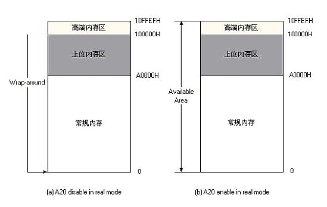

# 实模式    
## 说明：本节所讲的都是围绕实模式下的寻址方式以及一些历史遗留问题    
## 实模式的寻址方式与工作机理：    
&emsp; 8086是16位的cpu，只能访问地址在1M以下的内存称为常规内存，我们把地址在1M以上的内存称为扩展内存。实模式下有着16位的寄存器/16位数据总线/20位地址总线。一个地址有段和偏移两部分组成，物理地址的计算公式为：    

**physicaladdress=segment * 16 + offset    
其中，segment和offset都是16位的。**

&emsp;&emsp;通过上述分段技术模式，能够表示的最大内存为：FFFFh:FFFFh=FFFF0h+FFFFh=10FFEFh=1M+64K-16Bytes（1M多余出来的部分被称做高端内存区HMA）。但8086/8088只有20位地址线，只能够访问1M地址范围的数据，所以如果访问100000h~10FFEFh之间的内存（大于1M空间），则必须有第21根地址线来参与寻址（8086/8088没有）。因此，当程序员给出超过1M（100000H-10FFEFH）的地址时，因为逻辑上正常，系统并不认为其访问越界而产生异常，而是自动从0开始计算，也就是说系统计算实际地址的时候是按照**对1M求模**的方式进行的，这种技术被称为***wrap-around**。

&emsp; 对于80286或以上的CPU通过A20GATE来控制A20地址线 。 技术发展到了 80286，虽然系统的地址总线由原来的20根发展为24根，这样能够访问的内存可以达到2^24=16M,但是Intel在设计80286时提出的目标是向下兼容,所以在实模式下，系统所表现的行为应该和8086/8088所表现的完全一样，也就是说，在实模式下，80386以及后续系列应该和8086/8088完全兼容仍然使用A20地址线。所以说80286芯片存在一个BUG：它开设A20地址线。如果程序员访问100000H-10FFEFH之间的内存，系统将实际访问这块内存（没有wrap-around技术），而不是象8086/8088一样从0开始。我们来看一副图：    
    

&emsp;&emsp;为了解决上述兼容性问题，IBM使用键盘控制器上剩余的一些输出线来管理第21根地址线（从0开始数是第20根）的有效性，被称为A20Gate：

+ 如果A20Gate被打开，则当程序员给出100000H-10FFEFH之间的地址的时候，系统将真正访问这块内存区域；

+ 如果A20Gate被禁止，则当程序员给出100000H-10FFEFH之间的地址的时候，系统仍然使用8086/8088的方式即取模方式（8086仿真）。绝大多数IBMPC兼容机默认的A20Gate是被禁止的。现在许多新型PC上存在直接通过BIOS功能调用来控制A20Gate的功能。

&emsp;&emsp;上面所述的内存访问模式都是实模式，在80286以及更高系列的PC中，即使A20Gate被打开，在实模式下所能够访问的内存最大也只能为10FFEFH，尽管它们的地址总线所能够访问的能力都大大超过这个限制。为了能够访问10FFEFH以上的内存，则必须进入[保护模式](./protect_mode_part2.md)。
