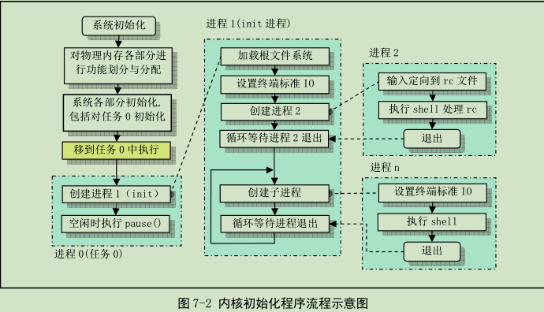
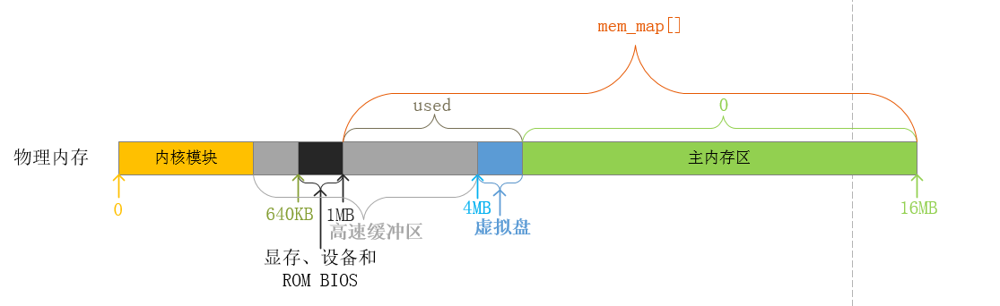

# Linux0.11 第七章 初始化程序

## 序言    
&emsp; 在内核源代码init/目录中只有一个main.c文件。当head.s程序执行完后会将执行权交给main.c。    
&emsp; 学习前提：熟悉C语言指针，了解gcc的扩展特性，如内联函数、内嵌汇编语句等。

## 一、main.c 程序    
#### 1. 功能描述      
&emsp;&emsp;init/main.c中的main函数是boot/head.s执行完后接着执行的代码。main函数首先统计物理内存的容量，并对物理内存进行功能划分。然后进行所有方面的硬件初始化工作，包括陷阱门，块设备，字符设备和tty。    
&emsp;&emsp;人工设置任务0(进程0)的PCB以及其在GDT表中的任务状态段描述符tss0和局部描述符表描述符ldt0，然后**通过模拟从特权级变化的内核中断处理过程的返回机制，手动切换到任务0中（这里的处理非常巧妙）。在任务0中通过fork()系统调用创建出子进程任务1(进程1：init进程)，由init进程进行进一步的处理工作。而任务0不会退出，它会在系统没有进程运行的空闲状态被调度执行，而任务0也只是调用pause()系统调用主动休眠，再次引发系统调度，以检查当前是否有其他进程需要调度。    
&emsp;&emsp;在整个内核完成初始化后，内核将执行权切换到了用户模式(任务0)中，也即CPU从0特权级切换到了3特权级。此时main.c的主程序就工作在任务0中。然后系统第一次调用进程创建函数fork()，创建出一个用于运行init()的子进程。

    
main.c程序首先确定如何分配使用系统物理内存，然后调用内核各部分的初始化函数分别对内存管理、中断处理、块设备和字符设备、进程管理以及硬盘和软盘硬件进行初始化处理。

+ 物理内存的功能划分    
`memory_end`变量记录了以字节为单位的物理内存的容量，并且是页大小(*4KB*)的整数倍。`buffer_memory_end`记录了高速缓冲区的尾端地址，其中包括了用于显存和设备以及ROM BIOS的物理内存。`main_memory_start`记录了主内存区的起始地址，一般来说，`main_memory_start`等于`buffer_memory_end`。如果系统包含虚拟盘，则`main_memory_start`的起始地址相对于`buffer_memory_end`的地址要后移，从而为虚拟盘留出内存空间。
由此可知，系统的物理内存被划分为内核模块，高速缓冲区，虚拟盘，主内存区四大部分。以拥有*16MB*的物理内存的系统为例，下图展示了其物理内存的功能划分：    
    
    + mem_map数组    
    **#TODO：**
